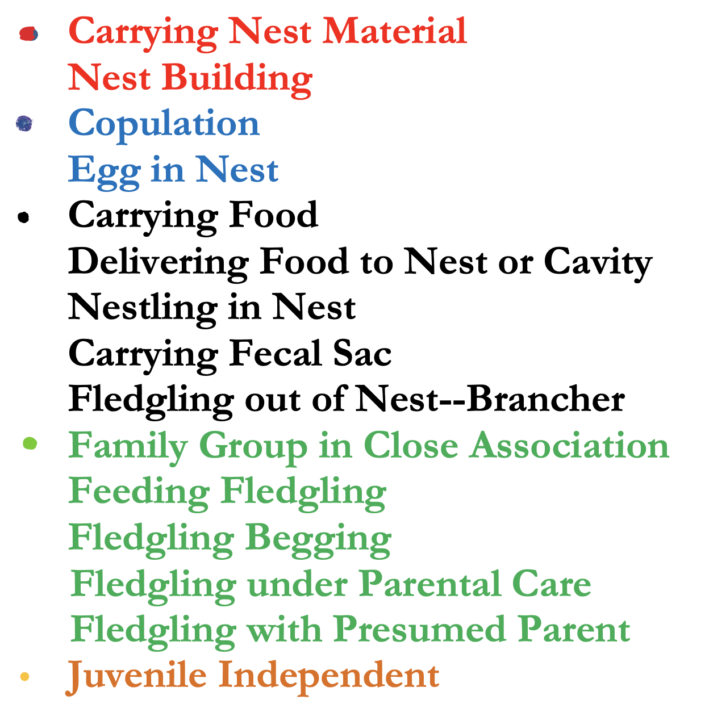
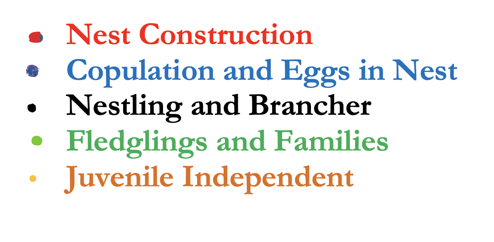
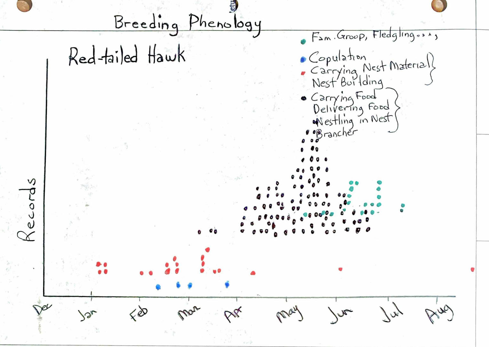

```{r setup, include=FALSE}
knitr::opts_knit$set(root.dir = rprojroot::find_rstudio_root_file())
knitr::opts_chunk$set(echo = TRUE, message = FALSE, warning = FALSE)
```

```{r include = FALSE}
library(tidyverse)
library(lubridate)
```

This is a very quick-and-dirty first attempt at making the graphs Mark requested for the SB BBS.

# Data prep
```{r}
# Read in data
data_full <- read.csv("BBS_data.csv")
```

There are `r length(unique(data_full$Breeding.Evidence))` types of breeding evidence in the dataset. Mark said he's focusing on 15 of them in the following categories:

{width=40%}

In the code below, I group the evidence types in the dataset into those categories, labeled by the corresponding color in Mark's list, and then make a categorical variable for the five groups.

These categories are described as follows:

{width=40%}

```{r}
# Get unique types of breeding evidence
breeding_evidence_cat <- unique(data_full$Breeding.Evidence)

# Select the 15 Mark is interested in
select_evidence_cat <- breeding_evidence_cat[c(11, 6, 22, 4, 13, 10, 3, 24, 1, 7, 9, 15, 27, 18, 20)]

# Group into the five categories
red_cat <- select_evidence_cat[c(1,2)]
blue_cat <- select_evidence_cat[c(3,4)]
black_cat <- select_evidence_cat[5:9]
green_cat <- select_evidence_cat[10:14]
orange_cat <- select_evidence_cat[15]

# Filter the dataset to only include observations with evidence in one of the 15 categories
data <- data_full %>% filter(Breeding.Evidence %in% select_evidence_cat)

# Make categorical variable
data$evidence_category <- rep(NA, nrow(data))
data$evidence_category[data$Breeding.Evidence %in% red_cat] <- "Nest construction"
data$evidence_category[data$Breeding.Evidence %in% blue_cat] <- "Copulation and eggs in nest"
data$evidence_category[data$Breeding.Evidence %in% black_cat] <- "Nestling and brancher"
data$evidence_category[data$Breeding.Evidence %in% green_cat] <- "Fledglings and families"
data$evidence_category[data$Breeding.Evidence %in% orange_cat] <- "Juvenile independent"
```

I also standardize the date format and make a new variable for week.

```{r}
# Standardize date format
data$Date <- dmy(data$Date)

# Make a new variable, week
data$week <- week(data$Date)
```

# Red-tailed Hawk

One of the graphs Mark asked for looks like this:

<center>



</center>

Here I filter observations only for Red-tailed Hawk, then summarize across week and group of evidence (among 5 groups).

```{r}
cond_evidence_by_week_rth <- data %>%
  filter(Common.Name == "Red-tailed Hawk") %>%
  group_by(week, evidence_category) %>%
  tally()
```

And then plot it. Each dot is the number of observations in a given week for a given type of evidence, across all years. The color denotes the evidence category.

```{r}
ggplot(cond_evidence_by_week_rth, aes(x = week, y = n, color = evidence_category)) +
  geom_point() +
  geom_smooth(se = FALSE, 
              lwd = 0.8) +
  scale_color_manual(values = c("blue", "green", "orange", "red", "black")) +
  labs(x = "Week", 
       y = "Count", 
       color = "Breeding evidence") +
  theme(plot.title = element_text(hjust = 0.5),
        plot.subtitle = element_text(hjust = 0.5),
        panel.background = element_rect(fill='white', colour='black'),
        panel.grid.major.y = element_line(colour = "gray"),
        legend.position = "right") +
  labs(title = "Breeding Phenology", 
       subtitle = "Red-tailed Hawk", 
       caption = "Dots represent total observations in a given week. Lines represent smoothed means.")

```


# White-tailed Kite

```{r}
cond_evidence_by_week_wtk <- data %>%
  filter(Common.Name == "White-tailed Kite") %>%
  group_by(week, evidence_category) %>%
  tally()
```

And then plot it. Each dot is the number of observations in a given week for a given type of evidence, across all years. The color denotes the evidence category.

```{r}
ggplot(cond_evidence_by_week_wtk, aes(x = week, y = n, color = evidence_category)) +
  geom_point() +
  geom_smooth(se = FALSE, 
              lwd = 0.8) +
  scale_color_manual(values = c("blue", "green", "orange", "red", "black")) +
  labs(x = "Week", 
       y = "Count", 
       color = "Breeding evidence") +
  theme(plot.title = element_text(hjust = 0.5),
        plot.subtitle = element_text(hjust = 0.5),
        panel.background = element_rect(fill='white', colour='black'),
        panel.grid.major.y = element_line(colour = "gray"),
        legend.position = "right") +
  labs(title = "Breeding Phenology", 
       subtitle = "White-tailed Kite", 
       caption = "Dots represent total observations in a given week. Lines represent smoothed means.")

```


# Cooper's Hawk

```{r}
cond_evidence_by_week_coop <- data %>%
  filter(Common.Name == "Cooper's Hawk") %>%
  group_by(week, evidence_category) %>%
  tally()
```

And then plot it. Each dot is the number of observations in a given week for a given type of evidence, across all years. The color denotes the evidence category.

```{r}
ggplot(cond_evidence_by_week_coop, aes(x = week, y = n, color = evidence_category)) +
  geom_line() +
  geom_smooth(se = FALSE, 
              lwd = 0.8) +
  scale_color_manual(values = c("blue", "green", "orange", "red", "black")) +
  labs(x = "Week", 
       y = "Count", 
       color = "Breeding evidence") +
  theme(plot.title = element_text(hjust = 0.5),
        plot.subtitle = element_text(hjust = 0.5),
        panel.background = element_rect(fill='white', colour='black'),
        panel.grid.major.y = element_line(colour = "gray"),
        legend.position = "right") +
  labs(title = "Breeding Phenology", 
       subtitle = "Cooper's Hawk", 
       caption = "Dots represent total observations in a given week. Lines represent smoothed means.")

```


# Red-shouldered Hawk

```{r}
cond_evidence_by_week_rsh <- data %>%
  filter(Common.Name == "Red-shouldered Hawk") %>%
  group_by(week, evidence_category) %>%
  tally()
```

And then plot it. Each dot is the number of observations in a given week for a given type of evidence, across all years. The color denotes the evidence category.

```{r}
ggplot(cond_evidence_by_week_rsh, aes(x = week, y = n, color = evidence_category)) +
  geom_point() +
  geom_smooth(se = FALSE, 
              lwd = 0.8) +
  scale_color_manual(values = c("blue", "green", "orange", "red", "black")) +
  labs(x = "Week", 
       y = "Count", 
       color = "Breeding evidence") +
  theme(plot.title = element_text(hjust = 0.5),
        plot.subtitle = element_text(hjust = 0.5),
        panel.background = element_rect(fill='white', colour='black'),
        panel.grid.major.y = element_line(colour = "gray"),
        legend.position = "right") +
  labs(title = "Breeding Phenology", 
       subtitle = "Red-shouldered Hawk", 
       caption = "Dots represent total observations in a given week. Lines represent smoothed means.")

```
